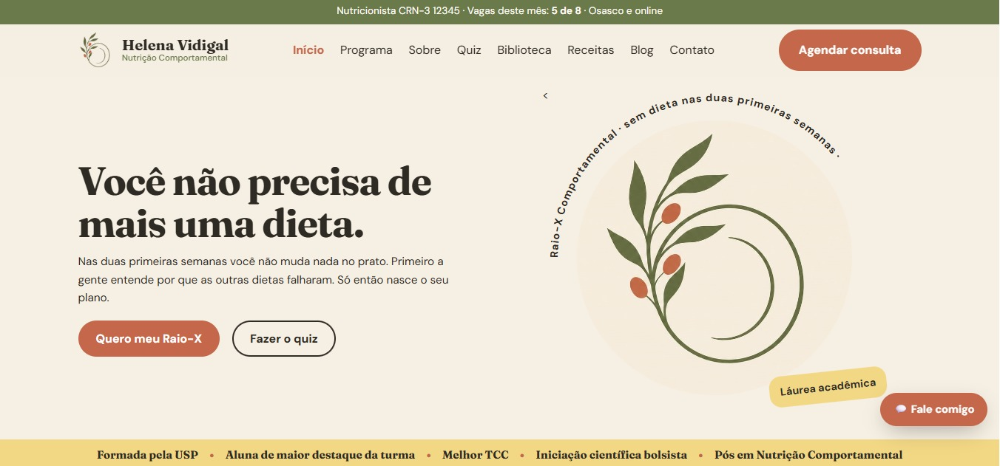

# Helena Vidigal | Behavioral Nutrition Website

A fictional commercial website for a nutritionist, built by **Giulia Samogin** and **Gabriella Cughele** as the final project of an **HTML and CSS course from Fundação Bradesco**.

> **Educational project.** All content, branding, people, prices, and information are entirely fictional.

**Live demo:** [giuliasamogin.github.io/html-course-nutrition-web](https://giuliasamogin.github.io/html-course-nutrition-web/)

<p align="center">
  <a href="https://giuliasamogin.github.io/html-course-nutrition-web/">
    
  </a>
</p>

## About

The site presents a behavioral nutrition practice in Osasco (Brazil) and online. Its message is simple: before any diet, understand why previous diets failed. The content is in Brazilian Portuguese.

## Pages

| Section | Pages |
|---|---|
| **Main** | `index.html`, `sobre.html`, `programa.html`, `turma.html`, `contato.html` |
| **Conversion** | `raio-x.html`, `quiz.html`, `ebook.html`, `kit-sos.html` |
| **Content** | `blog.html`, `artigo.html`, `receitas.html`, `glossario.html`, `mito-ou-ciencia.html`, `biblioteca.html`, `carta.html` |
| **Other** | `404.html` |

## Built with

- **HTML5**: semantic structure, forms, and accessible images
- **CSS3**: custom styles, responsive layout
- **JavaScript**: interactive features (quiz, animated counters)

## Project structure

```
html-course-nutrition-web/
├── css/        # stylesheets
├── js/         # scripts
├── midia/      # images, logos, and screenshots
├── *.html      # site pages
└── README.md
```

## Running locally

1. Clone the repository:
```bash
   git clone https://github.com/giuliasamogin/html-course-nutrition-web.git
```
2. Open the folder and double-click `index.html`, or serve it with any local server (for example, the VS Code *Live Server* extension).

No installation or build step is needed.

## What we practiced

- Semantic HTML and page structure
- Linking multiple pages and navigation
- Styling and responsive design with CSS
- Publishing a static site with GitHub Pages

## Authors

- **Giulia Samogin** - [GitHub](https://github.com/giuliasamogin)
- **Gabriella Cughele**

Developed during the HTML and CSS course at Fundação Bradesco.